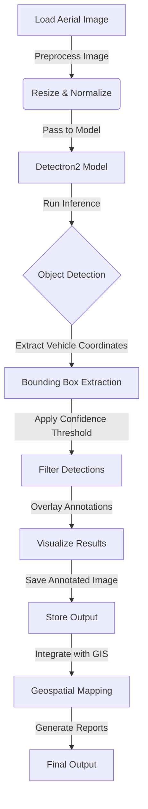

# Aerial Vehicle Mapper 🛁

Welcome to **Aerial Vehicle Mapper**! This repository provides a powerful tool for detecting and mapping vehicles from aerial images using the Detectron2 deep learning framework. 🚗🛰️

---

## Features ✨

- **Vehicle Detection**: Detects cars, trucks, buses, and motorbikes in aerial images.
- **High Accuracy**: Built on Detectron2's advanced object detection models.
- **Custom Thresholding**: Adjust detection confidence levels for greater flexibility.
- **Visualization**: Produces annotated images with bounding boxes for detected vehicles.

---

## Applications 🌍

- **Urban Planning**: Analyze traffic patterns and vehicle density in cities.
- **Surveillance**: Monitor vehicle movements for security purposes.
- **Disaster Management**: Identify vehicles in affected areas during emergencies.
- **Environmental Studies**: Study vehicular impact on ecosystems.
- **Infrastructure Development**: Aid in designing better road networks and parking facilities.

---

## Prerequisites 🛠️

Make sure you have the following:

- Python 3.8+
- NVIDIA GPU with CUDA support (for optimal performance)
- `pip` for package management

---

## Examples 🗂️

### Input Image

### Output Image

---

## How It Works ⚙️

---

## Dependencies 🛆

- Detectron2
- PyTorch
- OpenCV
- NumPy
- PyYAML

**Happy Mapping! 🗰️**

